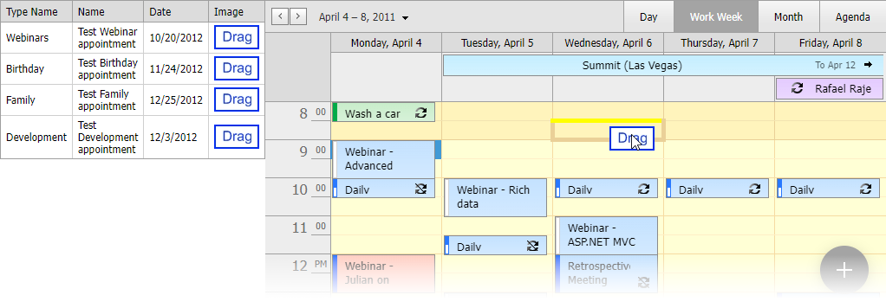

<!-- default badges list -->

<!-- default badges end -->

# ASP.NET Web Forms - How to drag a row from ASPxGridView to ASPxScheduler

This example demonstrates how to create an appointment in [ASPxScheduler](https://docs.devexpress.com/AspNet/DevExpress.Web.ASPxScheduler.ASPxScheduler) based on a row dragged from [ASPxGridView](https://docs.devexpress.com/AspNet/DevExpress.Web.ASPxGridView).

## Files to Review

* [Default.aspx](./CS/Default.aspx) (VB: [Default.aspx](./VB/Default.aspx))
* [Default.aspx.cs](./CS/Default.aspx.cs) (VB: [Default.aspx.vb](./VB/Default.aspx.vb))
* [script.js](./CS/scripts/script.js) (VB: [script.js](./VB/scripts/script.js))

## More Examples

* [How to drop an appointment from ASPxScheduler to an external control](https://github.com/DevExpress-Examples/how-to-drop-an-appointment-from-aspxscheduler-to-an-external-control-e4708)
